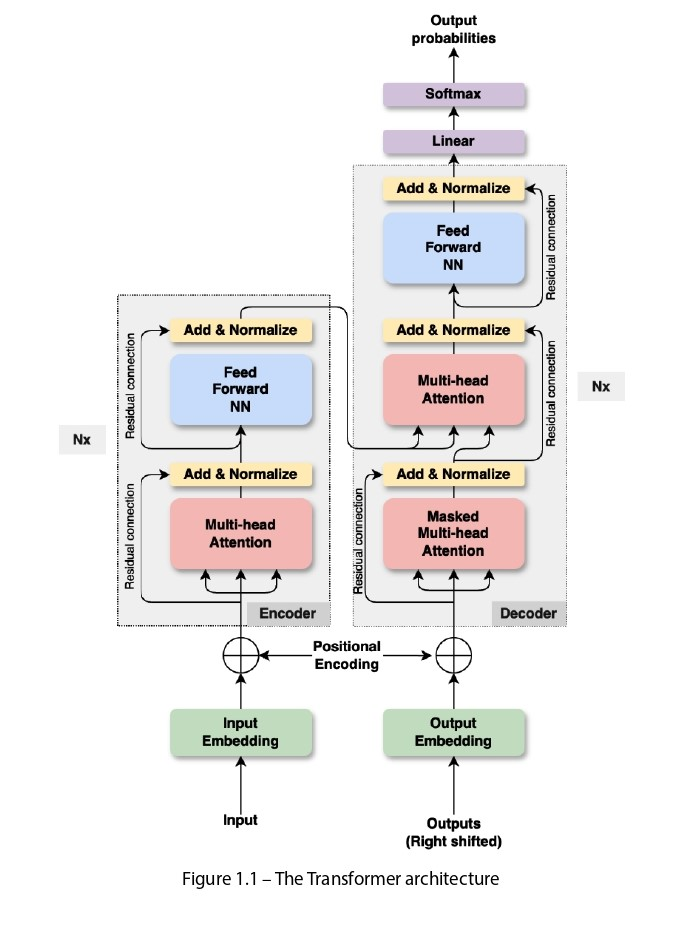

# **<u>Introduction to Generative AI</u>**

## What is Generative AI? 🤖

Generative AI is a category of artificial intelligence (AI) technologies capable of creating diverse content, including **text**, **images**, **audio**, and **videos**. These systems generate new content based on **training data** and input, typically **text prompts**, but they can also use other inputs like images. The recent excitement around generative AI stems from its ability to produce **high-quality content** in seconds through intuitive user interfaces. 🎉

In simple terms, generative AI **creates new data** that resembles its training data. By learning the **patterns**, **structures**, and **distributions** of the input data, the model generates similar yet novel outputs. For example:

- A model trained on human faces can create **realistic faces of non-existent people**. 😊
- Unlike **discriminative models**, which classify data (e.g., distinguishing cats from dogs), generative models **produce entirely new instances** (e.g., new cat or dog images).

## Historical Context 📜

The concept of generative AI dates back to the early days of **machine learning**, but it has gained prominence in the last decade due to advancements in **neural networks** and **computing power**. 💻

- **Early Models**: Techniques like **Gaussian Mixture Models** and **Hidden Markov Models** used basic statistical methods to model data distributions. These were limited in handling complex data. 📊
- **Deep Learning Revolution**: The rise of **deep learning** transformed generative AI. Key milestones include:
  - **Variational Autoencoders (VAEs)** (early 2010s): Leveraged deep neural networks to model complex distributions. 🔄
  - **Generative Adversarial Networks (GANs)**: Introduced a game-theoretic approach where two networks—a **generator** and a **discriminator**—compete to create realistic data. ⚔️

These breakthroughs enabled the generation of **high-quality, realistic content**, marking a turning point for the field. 🌟

## How Does Generative AI Work? ⚙️

Generative AI operates by learning the **probability distribution** of a dataset and sampling from it to create new instances. Here's a simplified process:

1. **Training Data**: The model is fed large datasets (e.g., images, text, or audio) to learn patterns. 📚
2. **Pattern Recognition**: It identifies structures and distributions within the data. 🧠
3. **Content Generation**: Using inputs like text prompts (e.g., "create a futuristic city"), the model generates new content aligned with learned patterns. 🎨
4. **Output**: The result is novel content that mimics the training data’s characteristics. ✨

## Applications of Generative AI 🌍

Generative AI is transforming industries with innovative applications:

- **Creative Industries** 🎭:
  - Artists and designers use it to brainstorm **new designs**, **music**, or **visual art**.
  - Film studios create **special effects** or **virtual characters**.
- **Healthcare** 🩺:
  - Accelerates **drug discovery** by designing new molecules.
  - Supports **personalized medicine** with tailored treatment plans.
- **Business & Marketing** 📈:
  - Generates **personalized ads**, **emails**, or **website content** for better customer engagement.
  - Powers **chatbots** for enhanced customer interactions.
- **Education** 📖:
  - Creates **customized learning materials** for students.
  - Enables **virtual tutors** or **simulations** for interactive learning.
- **Manufacturing** 🛠️:
  - Optimizes **product designs** and generates **prototypes**.

## Challenges and Ethical Considerations ⚖️

While generative AI offers immense potential, it raises important challenges:

1. **Creativity & Originality** 🎨:
   - What defines creativity when machines produce human-like content? 🤔
   - Can AI-generated work be considered the creation of an artist?
2. **Misuse** 🚨:
   - **Deepfakes** (fake videos/images) can deceive or spread misinformation.
   - Potential for generating **fake news** or **propaganda**.
3. **Copyright & Ownership** 📜:
   - Who owns content created from copyrighted training data? 🧑‍⚖️
   - Protecting artists’ rights is a growing concern.
4. **Bias in Data** ⚠️:
   - If training data is biased, the AI may produce **biased outputs** (e.g., underrepresenting certain groups).

## The Future of Generative AI 🔮

Generative AI is poised to revolutionize industries, making life **more efficient** and **creative**. However, addressing **ethical** and **legal challenges** is crucial. Governments, companies, and researchers must collaborate to create **guidelines** that maximize benefits while minimizing harm. 🌐

---

# **Types of Generative AI Models** 🤖

Generative AI is a fascinating field of artificial intelligence that focuses on creating new, synthetic data by learning patterns from existing datasets. The goal is to generate outputs that share similar statistical properties with the training data. Below is a detailed overview of the most prominent types of generative models: **Variational Autoencoders (VAEs)**, **Generative Adversarial Networks (GANs)**, **Autoregressive Models**, and their advanced applications like **Large Language Models (LLMs)**. Let’s dive in! 🚀

---

## **1. Variational Autoencoders (VAEs)** 🧠

### **What Are VAEs?**  
Variational Autoencoders (VAEs) are popular generative models that learn a **probabilistic mapping** between data and a latent space (a simplified, compressed representation of the data). VAEs compress data into this latent space and then reconstruct it into realistic-looking outputs. They are designed to:
- Ensure a high likelihood of generating data similar to the training set.
- Maintain a well-structured latent space for generating new samples.

**Simple Analogy:**  
Think of a VAE as a skilled artist 🎨 who can compress a detailed painting into a simple sketch (encoding) and then recreate the painting from that sketch (decoding). What makes VAEs special is that they don’t just copy—they learn the **essence** of the data, allowing them to create new, similar data. It’s like the artist learning a painting style so well that they can create original works in that style.

### **How VAEs Work** ⚙️  
1. **Encoding**: Compresses the input data (e.g., an image) into a smaller latent space that captures its key features.
2. **Learning Probability**: VAEs learn the probability distribution of the latent space, which helps them understand how features are related.
3. **Decoding**: Samples from the latent space to generate new data that resembles the training set.

### **Types of VAEs**

#### **a. Basic VAE**  
- The standard VAE model that compresses and reconstructs data.  
- It provides a framework for generating new samples from the learned latent space.  
- **Real-World Example**: In drug discovery, VAEs have been used to generate novel molecular structures. For instance, researchers at AstraZeneca used VAEs to explore chemical spaces and propose new drug-like molecules with desired properties, accelerating the drug development process. 💊

#### **b. Beta-VAE**  
- An extension of the basic VAE that introduces a **hyperparameter (beta)** to balance reconstruction quality and latent space disentanglement.  
- Disentanglement means the model separates features (e.g., color, shape, size) in the latent space, making them more interpretable.  
- **Simple Analogy**: It’s like teaching an art student to not just copy a painting but also to separate its elements—like color, shape, and style—for better understanding.  
- **Real-World Example**: In robotics, Beta-VAEs help robots understand objects better by separating features like size, color, and position. This makes robots more adaptable for tasks like object recognition and manipulation. 🤖

#### **c. Conditional VAE (CVAE)**  
- A variant of VAE that conditions the generation process on extra information, such as class labels, to generate data from specific categories.  
- **Simple Analogy**: Imagine an artist who can paint on demand—told to “paint a landscape” or “paint a portrait,” they create art in that specific category. CVAE works similarly by generating controlled outputs.  
- **Real-World Example**: In game development, CVAEs are used for procedural content generation, creating game elements like character designs, level layouts, and music. For example, a CVAE can generate a “forest level” or “desert level” based on the given condition, saving time for designers and enhancing player experiences. 🎮

---

## **2. Generative Adversarial Networks (GANs)** ⚔️

### **What Are GANs?**  
Generative Adversarial Networks (GANs) consist of two neural networks that work in competition:  
1. **Generator**: Creates synthetic data samples that mimic the training data.  
2. **Discriminator**: Evaluates whether the generated data is real (from the training set) or fake (from the generator).  

These networks are trained **adversarially**—the generator tries to “fool” the discriminator, while the discriminator improves at distinguishing real data from fake. Through this competition, the generator gets better at creating realistic data.

**Simple Analogy:**  
Imagine the generator as a counterfeiter 🖌️ trying to create fake money, and the discriminator as a detective 🕵️ trying to spot the fakes. As they compete, the counterfeiter improves, making the fake money look more and more real.

### **Types of GANs**

#### **a. Basic GAN**  
- The foundational GAN model where the generator and discriminator are trained adversarially.  
- It’s the root of most innovations in generative modeling.  
- **Simple Analogy**: The counterfeiter-detective game results in increasingly realistic fake data, like images or audio. 🎵

#### **b. Deep Convolutional GAN (DCGAN)**  
- An enhanced version of GAN that uses **deep convolutional neural networks** (CNNs).  
- It excels at generating high-quality images by understanding complex patterns.  
- **Simple Analogy**: If a basic GAN is a simple sketch artist, a DCGAN is a digital artist with advanced tools, creating detailed and realistic images. 🖼️

#### **c. Wasserstein GAN (WGAN)**  
- A variant of GAN that uses the **Wasserstein distance** as a loss function, making training more stable and improving sample quality.  
- **Simple Analogy**: It’s like giving the counterfeiter and detective a better way to communicate. Instead of just saying “good” or “bad,” they provide nuanced feedback like “you’re getting closer,” leading to better results.  
- **Real-World Example**: WGANs are used in medical imaging to generate synthetic images for training diagnostic AI systems, improving disease detection from scans and X-rays. 🩺

#### **d. StyleGAN**  
- An advanced GAN model that generates **high-quality, realistic images** and separates **style** and **content**.  
- Later versions like StyleGAN2 and StyleGAN3 further improve image fidelity and realism.  
- **Simple Analogy**: Think of StyleGAN as a digital artist who can mix styles—like applying Van Gogh’s style to a modern cityscape. It’s incredibly versatile! 🎨 
- **Real-World Example**: StyleGAN is used to create photorealistic human faces or artistic visuals for movies and games.

---

## **3. Autoregressive Models** 📝

### **What Are Autoregressive Models?**  
Autoregressive models generate data **sequentially**, producing one piece (or token) at a time while depending on previously generated pieces. They are commonly used for text and image generation.

**Simple Analogy:**  
Imagine writing a story ✍️ where each new word you write depends on the words you’ve already written. Autoregressive models work similarly, generating data step by step.

### **Transformer Architecture Explained** 🏗️  
The **Transformer** architecture is a key foundation for many autoregressive models, such as GPT. Let’s break down the Transformer architecture using the provided image titled *Figure 1.1 – The Transformer Architecture*.

  

#### **Components of the Transformer Architecture**

1. **Input and Output Embedding**  
   - **Input Embedding** (bottom left): Converts input data (e.g., text) into numerical representations the model can understand.  
   - **Output Embedding** (bottom right): Converts the decoder’s output back into data (e.g., text).  
   - **Positional Encoding**: Adds information about the position of each element in the sequence (e.g., word order in a sentence), which is crucial for understanding sequences. 📍

2. **Encoder (Left Side)**  
   - The encoder has **N layers** (denoted as “Nx” in the image), meaning the process repeats multiple times.  
   - Each layer consists of:  
     - **Multi-Head Attention**: Allows the model to focus on different parts of the input simultaneously (e.g., understanding the relationship between “I” and “eat” in a sentence).  
     - **Add & Normalize**: Stabilizes the data after each step.  
     - **Feed Forward Neural Network (NN)**: Processes each element individually.  
     - **Add & Normalize** (again): Further stabilizes the data.  
   - The encoder’s job is to understand the input data and create a meaningful representation. 🧩

3. **Decoder (Right Side)**  
   - The decoder also has **N layers** and takes input from the encoder.  
   - Each layer includes:  
     - **Masked Multi-Head Attention**: Ensures the model only looks at previous tokens (not future ones), which is key for autoregressive generation.  
     - **Add & Normalize**: Stabilizes the data.  
     - **Multi-Head Attention**: Uses the encoder’s output to understand the relationship between input and output.  
     - **Add & Normalize** (again): Stabilizes the data.  
     - **Feed Forward NN**: Processes each token.  
     - **Add & Normalize** (final): Final stabilization.  
   - **Linear & Softmax**: Converts the decoder’s output into probabilities to predict the next token (e.g., the next word). 📊

4. **Residual Connections**  
   - Dotted lines in the image represent **residual connections**, which allow data to flow directly to the next layer, preventing information loss during processing. 🔄

**What Transformers Do:**  
Transformers are powerful for sequence data (like text) because they can focus on the entire sequence at once (via multi-head attention) while understanding the order of elements (via positional encoding). They are used in both **autoregressive** (e.g., GPT) and **non-autoregressive** (e.g., BERT) models.

### **Types of Autoregressive Models**

#### **a. PixelCNN**  
- Generates images **pixel by pixel**, with each pixel conditioned on previously generated pixels.  
- **Simple Analogy**: It’s like drawing an image one pixel at a time, where each new pixel depends on the ones already drawn.  
- **Use Case**: Creates high-quality images with fine details. 🖼️

#### **b. PixelSNAIL**  
- An improved version of PixelCNN that adds **attention mechanisms** to better capture dependencies between pixels.  
- **Use Case**: Produces higher-quality images compared to PixelCNN.

#### **c. GPT (Generative Pre-trained Transformer)**  
- A popular autoregressive model for **text generation**, predicting the next word based on previous words.  
- Models like GPT-2, GPT-3, and GPT-4 are highly advanced and can generate human-like text for tasks like storytelling, answering questions, or coding. ✍️

#### **d. BERT (Bidirectional Encoder Representations from Transformers)**  
- Unlike GPT, BERT is **not autoregressive**. It processes the entire text at once (bidirectionally) to understand context.  
- **Use Case**: Used for tasks like text classification, sentiment analysis, and named entity recognition. 📚

#### **e. T5 (Text-To-Text Transfer Transformer)**  
- Frames all NLP tasks as text-to-text problems, using both encoder and decoder.  
- **Use Case**: Handles tasks like translation, summarization, and question-answering. 🌐

---

## **4. Large Language Models (LLMs)** 🌍

Building on autoregressive models and Transformers, researchers have developed **Large Language Models (LLMs)**, which are trained on massive datasets and can generate human-like text. Here are the main types of LLMs:

1. **Autoregressive LLMs**  
   - Generate text sequentially, one token at a time.  
   - **Examples**: GPT-3, GPT-4, PaLM.  
   - **Use Case**: Text generation, creative writing, and text completion. ✍️

2. **Encoder-Only LLMs**  
   - Focus on understanding text (natural language understanding, NLU).  
   - **Examples**: BERT, RoBERTa.  
   - **Use Case**: Text classification, sentiment analysis, and named entity recognition. 📖

3. **Encoder-Decoder LLMs**  
   - Combine understanding and generation capabilities.  
   - **Examples**: T5, BART.  
   - **Use Case**: Translation, summarization, and question-answering. 🌟

4. **Multimodal LLMs**  
   - Handle multiple data types (text, images, audio, video).  
   - **Examples**: DALL-E, Stable Diffusion, GPT-4, Flamingo, LLaVA.  
   - **Use Case**: Generate text, images, or mixed content (e.g., creating an image from a text prompt). 🎨

5. **Instruction-Tuned LLMs**  
   - Fine-tuned on specific instructions to perform targeted tasks.  
   - **Example**: InstructGPT (a fine-tuned version of GPT-3).  
   - **Use Case**: Chatbots, virtual assistants, and task-specific applications. 💬

6. **Domain-Specific LLMs**  
   - Trained on specialized datasets for specific fields.  
   - **Examples**: BioBERT (medical), LegalBERT (legal).  
   - **Use Case**: Specialized tasks in medicine, law, or finance. 🩺📜

---
