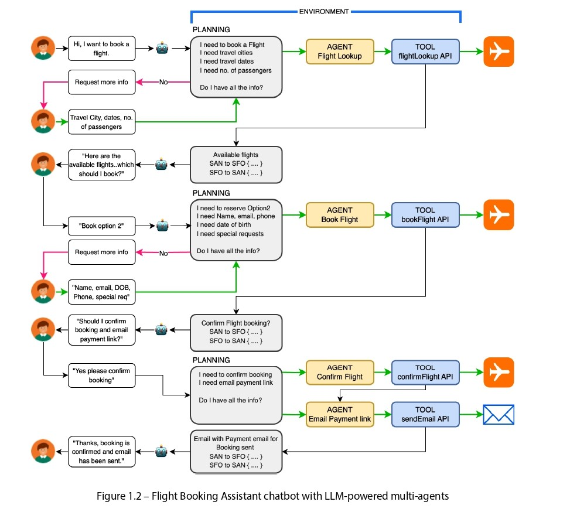

# Flight Booking Assistant:✈️

This document provides a detailed explanation of the **Flight Booking Assistant** chatbot, an LLM-powered multi-agent system designed to help users book flights seamlessly. It breaks down the process, system architecture, and key components as shown in the provided conversation and flowchart (Figure 1.2). Let's dive into how this intelligent system works! 🧠💡

---

## 🌟 What is the Flight Booking Assistant?

The **Flight Booking Assistant** is a conversational AI chatbot integrated into a travel website. Powered by a **Large Language Model (LLM)**, it assists users in booking flights by interacting in a human-like manner. It can:

- Understand vague user requests 📝
- Ask for missing information 🗣️
- Search for flights using external APIs 🔍
- Book flights and send payment links 📧

This system is an example of an **agentic system**, where multiple AI agents work together to complete complex tasks. Let's break down the process step by step! 🚀
---

| **🧾 Speaker** | **💬 Conversation**                                                                                                                                                                                                                                                                                                                                                                                                                                                                                                                                                                                                                                                                                                                                                                                                                                                                                                                                                                                                                                                                                                                                                                                                                                                                                                                                                                  |
| -------------- | ------------------------------------------------------------------------------------------------------------------------------------------------------------------------------------------------------------------------------------------------------------------------------------------------------------------------------------------------------------------------------------------------------------------------------------------------------------------------------------------------------------------------------------------------------------------------------------------------------------------------------------------------------------------------------------------------------------------------------------------------------------------------------------------------------------------------------------------------------------------------------------------------------------------------------------------------------------------------------------------------------------------------------------------------------------------------------------------------------------------------------------------------------------------------------------------------------------------------------------------------------------------------------------------------------------------------------------------------------------------------------------ |
| 👤             | Hi, I want to book a flight.                                                                                                                                                                                                                                                                                                                                                                                                                                                                                                                                                                                                                                                                                                                                                                                                                                                                                                                                                                                                                                                                                                                                                                                                                                                                                                                                                         |
| 🤖             | Hello! I’d be happy to help you book a flight. To get started, could you please tell me your departure city and destination?                                                                                                                                                                                                                                                                                                                                                                                                                                                                                                                                                                                                                                                                                                                                                                                                                                                                                                                                                                                                                                                                                                                                                                                                                                                         |
| 👤             | I want to go from San Diego to SFO.                                                                                                                                                                                                                                                                                                                                                                                                                                                                                                                                                                                                                                                                                                                                                                                                                                                                                                                                                                                                                                                                                                                                                                                                                                                                                                                                                  |
| 🤖             | Great, thank you for providing that information. You’re looking to fly from San Diego (SAN) to San Francisco International Airport (SFO). To help you find the best flight options, I’ll need a few more details.   1. What is your preferred travel date?   2. Is this a one-way trip or a round trip?   3. How many passengers will be traveling?                                                                                                                                                                                                                                                                                                                                                                                                                                                                                                                                                                                                                                                                                                                                                                                                                                                                                                                                                                                                                         |
| 👤             | I want to go next Friday and come back on Sunday. Just me traveling.                                                                                                                                                                                                                                                                                                                                                                                                                                                                                                                                                                                                                                                                                                                                                                                                                                                                                                                                                                                                                                                                                                                                                                                                                                                                                                                 |
| 🤖             | Thank you for the additional information. Let me summarize what I have so far:   - Departure: San Diego (SAN) to San Francisco (SFO)   - Outbound Date: Next Friday – 08/23/2024   - Return Date: Sunday – 08/25/2024   - Passengers: 1 adult   Before I search for flights, I have a few more questions:   1. Do you have a preferred time of day for your flights (morning, afternoon, or evening)?   2. Do you have a preferred airline or are you open to all airlines?   3. What class of service would you prefer (Economy, Premium Economy, Business, or First Class)?                                                                                                                                                                                                                                                                                                                                                                                                                                                                                                                                                                                                                                                                                                                                                                                |
| 👤             | I prefer morning flights. No airline preference. Economy is fine.                                                                                                                                                                                                                                                                                                                                                                                                                                                                                                                                                                                                                                                                                                                                                                                                                                                                                                                                                                                                                                                                                                                                                                                                                                                                                                                    |
| 🤖             | Thank you for those details. I’ll search for morning flights in Economy class across all airlines for your trip. Give me a moment to find the best options for you.   \[searching flights...please stand by….]                                                                                                                                                                                                                                                                                                                                                                                                                                                                                                                                                                                                                                                                                                                                                                                                                                                                                                                                                                                                                                                                                                                                                                    |
| 🤖             | I’ve found a few options for your trip. Here are the best morning flights:    **Outbound (SAN to SFO) - Next Friday:**   1. United Airlines UA1234: Depart 7:15 AM, Arrive 8:45 AM   2. Alaska Airlines AS5678: Depart 8:30 AM, Arrive 10:00 AM    **Return (SFO to SAN) - Sunday:**   1. Delta Air Lines DL9876: Depart 9:00 AM, Arrive 10:30 AM   2. Southwest Airlines WN5432: Depart 10:15 AM, Arrive 11:45 AM    **Total price for the round trip, including taxes and fees:**   - Option 1 (United/Delta): \$325   - Option 2 (Alaska/Southwest): \$310    Which option would you prefer? Or would you like me to look for different flights?                                                                                                                                                                                                                                                                                                                                                                                                                                                                                                                                                                                                                                                                                        |
| 👤             | The second option looks good. Can you book that for me?                                                                                                                                                                                                                                                                                                                                                                                                                                                                                                                                                                                                                                                                                                                                                                                                                                                                                                                                                                                                                                                                                                                                                                                                                                                                                                                              |
| 🤖             | Certainly! I’d be happy to book the second option for you. Just to confirm, I’ll be booking the following itinerary:    **Outbound: Alaska Airlines AS5678**   - Date: 08/23/2024   - Depart San Diego at 8:30 AM, Arrive in SFO at 10:00 AM    **Return: Southwest Airlines WN5432**   - Date: 08/25/2024   - Depart SFO at 10:15 AM, Arrive in San Diego at 11:45 AM    **Total price: \$310**    To proceed with the booking, I’ll need some additional information:   1. Your full name as it appears on your government-issued ID   2. Your date of birth   3. Your email address (for sending the confirmation)   4. Your phone number   5. Any special requests (for example, meal preferences, seat preferences)    Also, please note that you’ll need to provide a form of payment to complete the booking.   Are you ready to proceed with this information?                                                                                                                                                                                                                                                                                                                                                                                                                                                   |
| 👤             | Yes, I’m ready. My name is John Smith, born on 05/15/1985. My email is [john.smith@email.com](mailto:john.smith@email.com) and my phone number is 555-123-4567. No special requests.                                                                                                                                                                                                                                                                                                                                                                                                                                                                                                                                                                                                                                                                                                                                                                                                                                                                                                                                                                                                                                                                                                                                                                                                 |
| 🤖             | Thank you for providing that information, Mr. Smith. I’ve entered your details into the booking system. Here’s a summary of the information I have:   - Name: John Smith   - Date of Birth: 05/15/1985   - Email: [john.smith@email.com](mailto:john.smith@email.com)   - Phone: 555-123-4567   - Special Requests: None    The final step is to process the payment of \$310 for your flights. For security reasons, I can’t accept credit card information directly in this chat. Instead, I’ll send a secure payment link to your email address ([john.smith@email.com](mailto:john.smith@email.com)).    Once you receive the email, please follow the link to complete the payment process. After the payment is successfully processed, you’ll receive another email with your flight confirmation and e-tickets.    This email will include important information such as:   1. Booking confirmation number   2. Detailed flight itinerary   3. Check-in instructions   4. Baggage allowance information   5. Airline contact information    After you receive your confirmation email, please review all the details to ensure everything is correct. If you notice any issues or have any questions, please don’t hesitate to contact us.    Is it okay to proceed with sending the payment link to your email? |
| 👤             | Yes, that’s fine. Please send the payment link.                                                                                                                                                                                                                                                                                                                                                                                                                                                                                                                                                                                                                                                                                                                                                                                                                                                                                                                                                                                                                                                                                                                                                                                                                                                                                                                                      |
| 🤖             | Excellent, Mr. Smith. I’ve initiated the process to send the secure payment link to your email address ([john.smith@email.com](mailto:john.smith@email.com)). You should receive it within the next few minutes.    Please check your inbox and spam folder if you don’t see it right away.    Once you complete the payment, the system will automatically process your booking and send your confirmation email with the e-tickets. This email will include important information such as:   - Booking confirmation number   - Flight itinerary   - Check-in and baggage info    After you receive your confirmation email, please review all the details to ensure everything is correct. If you notice any issues or have any questions, please don’t hesitate to contact us.    Is there anything else you need assistance with regarding your trip or the booking process?                                                                                                                                                                                                                                                                                                                                                                                                                                                                    |
| 👤             | No, that’s all. Thank you for your help!                                                                                                                                                                                                                                                                                                                                                                                                                                                                                                                                                                                                                                                                                                                                                                                                                                                                                                                                                                                                                                                                                                                                                                                                                                                                                                                                             |
| 🤖             | You’re welcome, Mr. Smith! I’m glad I could assist you with booking your flights from San Diego to San Francisco. If you need any further assistance with this booking or have any questions about your trip, please don’t hesitate to reach out. We’re here to help 24/7. Have a great trip to San Francisco next week! ✈️🗺️😊                                                                                                                                                                                                                                                                                                                                                                                                                                                                                                                                                                                                                                                                                                                                                                                                                                                                                                                                                                                                                                                     |

---

  

## 🛠️ How Does the Flight Booking Assistant Work?

The assistant follows a structured workflow involving **planning**, **agent execution**, and **tool calling**. Here's a detailed breakdown of the process based on the conversation and flowchart:

### 1️⃣ **User Initiates the Request**

The user starts with a simple request:

> *"Hi, I want to book a flight."*

This request is vague, so the assistant needs more details to proceed. It enters the **Planning Phase** to determine what information is required. 🗺️

---

### 2️⃣ **Planning Phase: Gathering Information**

The assistant uses a **Planning Agent** to decide what details are needed to look up flights. It identifies:

- Departure and destination cities 🌍
- Travel dates 📅
- Number of passengers 👥
- Additional preferences (e.g., time of day, class of service) ⏰💺

#### **Assistant's Response:**

The assistant asks:

> *"Hello! I’d be happy to help you book a flight. To get started, could you please tell me your departure city and destination?"*

#### **User's Response:**

The user provides:

> *"I want to go from San Diego to SFO."*\
 **"I want to go next Friday and come back on Sunday. Just me traveling."*\
 **"I prefer morning flights. No airline preference. Economy is fine."*

#### **What Happens in the Background?**

- The **Planning Agent** checks: *"Do I have all the info?"*
- Initially, it doesn't, so it keeps asking the user for more details (e.g., travel dates, preferences).
- Once it has enough info, it moves to the next step: **Flight Lookup**. 🔍✈️

---

### 3️⃣ **Flight Lookup: Finding Available Flights**

With the user's details (San Diego to SFO, morning flights, economy class, etc.), the assistant uses the **Flight Lookup Agent** to call the **flightLookup_API**. This API searches for available flights matching the criteria.

#### **Assistant's Response:**

The assistant finds and presents options:

> \*"I’ve found a few options for your trip. Here are the best morning flights:\
> Outbound (SAN to SFO) - Next Friday:
>
> 1. United Airlines UA1234: Depart 7:15 AM, Arrive 8:45 AM
> 2. Alaska Airlines AS5678: Depart 8:30 AM, Arrive 10:00 AM\
>    Return (SFO to SAN) - Sunday:
> 3. Delta Air Lines DL9876: Depart 9:00 AM, Arrive 10:30 AM
> 4. Southwest Airlines WN5432: Depart 10:15 AM, Arrive 11:45 AM\
>    The total price for the round trip, including taxes and fees, is:
>
> - Option 1 (United/Alaska): $325
> - Option 2 (Delta/Southwest): $310\
>   Which option would you prefer?"\*

#### **What Happens in the Background?**

- The **Flight Lookup Agent** sends the user's details to the **flightLookup_API**.
- The API returns a list of available flights, which the assistant presents to the user.
- The user selects **Option 2** (Delta/Southwest for $310). ✅

---

### 4️⃣ **Booking Phase: Reserving the Flight**

After the user selects Option 2, the assistant enters another **Planning Phase** to book the flight. It needs additional details to complete the booking, such as:

- Full name 📛
- Date of birth 🎂
- Email address 📧
- Phone number 📞
- Special requests (if any) 🛠️

#### **Assistant's Response:**

The assistant asks:

> \*"To proceed with the booking, I’ll need some additional information:
>
> 1. Your full name as it appears on your government-issued ID
> 2. Your date of birth
> 3. Your email address (for sending the confirmation)
> 4. Your phone number
> 5. Any special requests (for example, meal preferences, seat preferences)"\*

#### **User's Response:**

The user provides:

> *"Yes, I’m ready. My name is John Smith, born on 05/15/1985. My email is john.smith@email.com and my phone number is 555-123-4567. No special requests."*

#### **What Happens in the Background?**

- The **Planning Agent** confirms it has all the info: *"Do I have all the info?"* ✅
- The **Book Flight Agent** calls the **bookFlight_API** with the user's details to reserve the selected flights. ✈️

---

### 5️⃣ **Payment and Confirmation Phase**

The assistant now needs to process the payment and confirm the booking. It cannot accept credit card details directly for security reasons, so it sends a secure payment link to the user's email.

#### **Assistant's Response:**

The assistant says:

> *"The final step is to process the payment of $310 for your flights. For security reasons, I can’t accept credit card information directly in this chat. Instead, I’ll send a secure payment link to your email address (john.smith@email.com).\
> Once you receive the email, please follow the link to complete the payment process."*

#### **User's Response:**

The user agrees:

> *"Yes, that’s fine. Please send the payment link."*

#### **What Happens in the Background?**

- The **Planning Agent** identifies the need for a payment link: *"I need to confirm booking, I need email payment link."*
- The **Confirm Flight Agent** calls the **confirmFlight_API** to finalize the booking.
- The **Email Payment Link Agent** calls the **sendEmail_API** to send the payment link to the user's email. 📧
- Once the payment is completed, the system sends a confirmation email with the e-tickets, including:
  - Booking confirmation number 🔢
  - Detailed flight itinerary 🗺️
  - Check-in instructions 📋
  - Baggage allowance info 🧳
  - Airline contact info 📞

#### **Final Assistant Response:**

The assistant concludes:

> *"You’re welcome, Mr. Smith! I’m glad I could assist you with booking your flights from San Diego to San Francisco. Have a great trip to San Francisco next week!"* 🌟

---

## 📊 Flowchart Breakdown (Figure 1.2)

The flowchart (Figure 1.2) visually represents the entire process. Here's a detailed breakdown:

### **🔹 Left Side: User Inputs**

- The user's messages are shown on the left, starting with *"Hi, I want to book a flight"* and progressing to providing details like cities, dates, and personal info.
- The assistant responds with *"Request more info"* until it has enough data to proceed.

### **🔹 Center: Planning Phases**

The assistant uses **Planning Agents** to decide what to do at each step:

1. **First Planning Box:**
   - Identifies the need to book a flight.
   - Lists required info: travel cities, dates, number of passengers.
   - Asks: *"Do I have all the info?"* If not, it requests more details from the user.
2. **Second Planning Box:**
   - Identifies the need to reserve the user's selected option (Option 2).
   - Lists required info: name, email, phone, date of birth, special requests.
   - Asks: *"Do I have all the info?"*
3. **Third Planning Box:**
   - Identifies the need to confirm the booking and send a payment link.
   - Asks: *"Do I have all the info?"*

### **🔹 Right Side: Agents and Tools**

Each planning step leads to an **Agent** that calls a specific **Tool** (API):

- **Flight Lookup Agent** → **flightLookup_API** (searches for flights).
- **Book Flight Agent** → **bookFlight_API** (reserves the flight).
- **Confirm Flight Agent** → **confirmFlight_API** (finalizes the booking).
- **Email Payment Link Agent** → **sendEmail_API** (sends the payment link).

### **🔹 Top Right: Environment**

The environment represents external systems the assistant interacts with, such as the flight booking APIs and email system. 🌐

---

## 🧠 Key Features of the System

This Flight Booking Assistant showcases several advanced features of LLM-powered agentic systems:

1. **Chain of Thought (CoT):**

   - The assistant "thinks" step-by-step to determine what information is missing and what actions to take. This is shown in the planning phases: *"Do I have all the info?"* 🤔

2. **Multi-Agent Architecture:**

   - The system uses multiple agents (Flight Lookup, Book Flight, Confirm Flight, Email Payment Link) to handle specific tasks. Each agent is specialized and works with a corresponding API. 🛠️

3. **Tool Calling:**

   - The assistant interacts with external tools (APIs) to perform real-world actions like searching for flights, booking them, and sending emails. 🔧

4. **Interactive and Adaptive:**

   - The assistant adapts to the user's responses. If the user provides incomplete info, it asks for more. If the info is sufficient, it proceeds to the next step. 🗣️

5. **Human-Like Interaction:**

   - The assistant communicates naturally, summarizing details for the user and ensuring clarity at every step. 🌟

---

## 🚀 Why is This System Important?

The Flight Booking Assistant demonstrates the power of **LLM-powered agents** in handling complex, multi-step tasks. Unlike traditional LLMs that only generate text, this system:

- Combines **planning**, **tool use**, and **introspection** to achieve goals.
- Interacts with external systems (APIs) to perform real-world actions.
- Provides a seamless user experience by guiding the user through the process.

This makes it ideal for applications like customer service, travel booking, e-commerce, and more! 🌍✨

---

## 📝 Conclusion

The **Flight Booking Assistant** is a perfect example of how LLM-powered multi-agent systems can revolutionize user interactions. By breaking down tasks into manageable steps, using specialized agents, and integrating with external tools, it provides an efficient and user-friendly way to book flights. As AI technology advances, such systems will become even more capable, handling increasingly complex workflows with ease. 🚀✈️

If you'd like to explore more about LLM agents or build a similar system, let me know! 😊